# Android pdf417.mobi integration instructions

The package contains two Android projects: 

 - Pdf417MobiSdk which is the library project which you include in your applications
 - Pdf417MobiDemo demo application which demonstrates the usage of Pdf417MobiSdk
 
 Pdf417.mobi is supported on Android SDK version 8 (Android 2.2) or later.
 
 The project contains one Activity called ScanActivity that is responsible for camera control and barcode recognition

 For more info visit http://pdf417.mobi

## Quick start to get and run Android demo in Eclipse

1. Go to https://github.com/PDF417/android and copy GitHub code URL as shown on picture:

	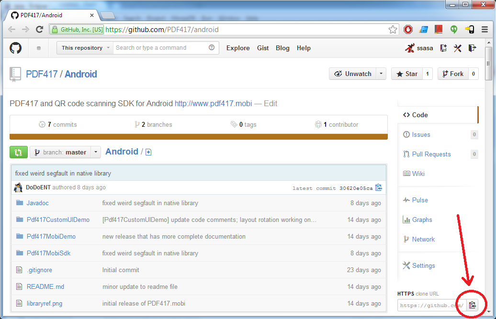

2. Paste this URL to Eclipse Git Repository view:

	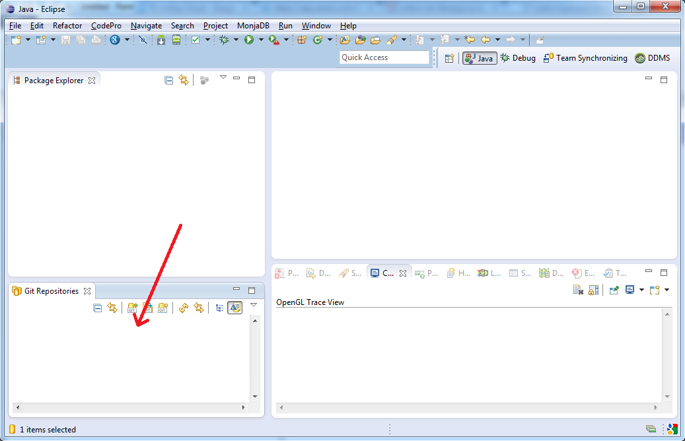

3. Pass through "Clone Git Repository" by clicking Next, Next and Finish:

	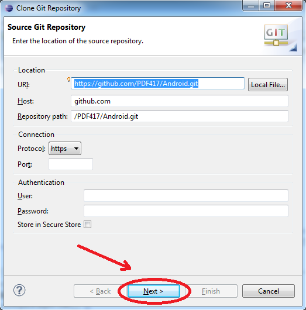
	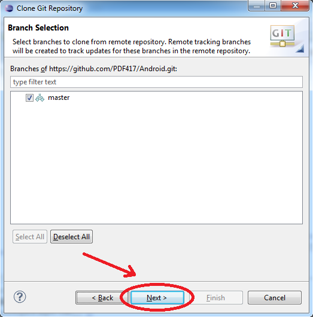
	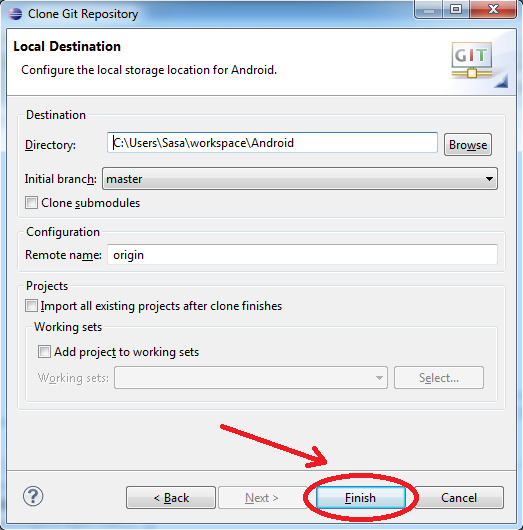
	
   Cloned project shows as on this picture:

	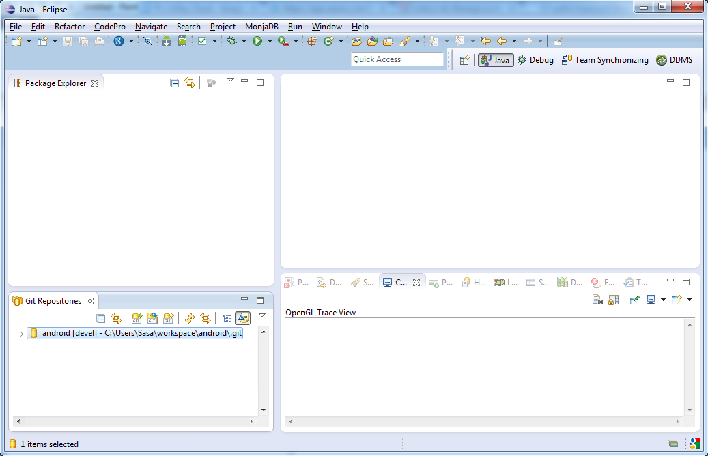

4. Right click with your mouse on Package Explorer in Eclipse and then on "Import...":

	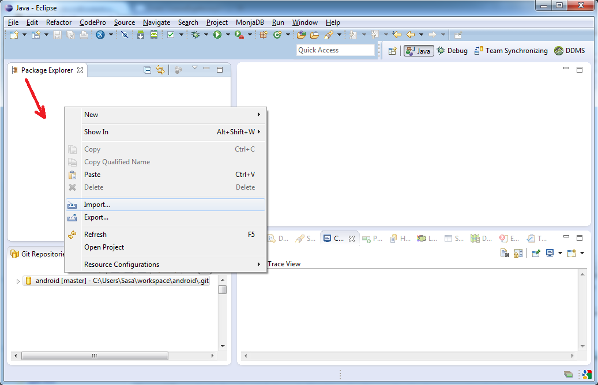

5. Select "Android -> Existing Android Code Into Workspace" and then "Next":

	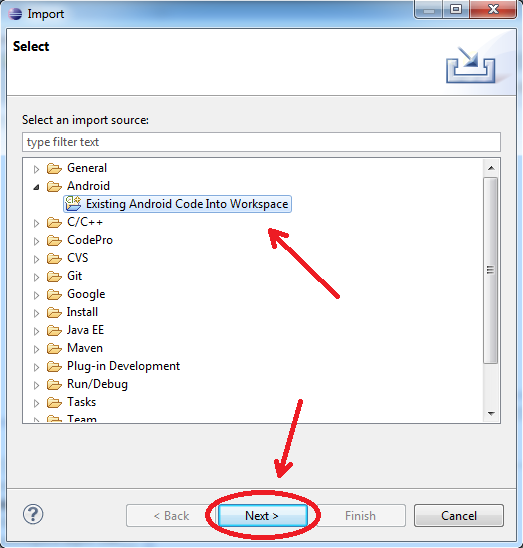

6. Click on "Browse..." and then search for "android" folder in your Eclipse workspace. Click OK.

	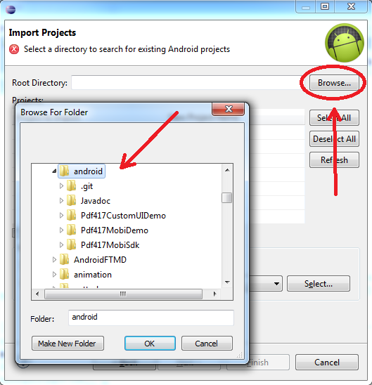

7. Just click on Finish to import the three projects:

	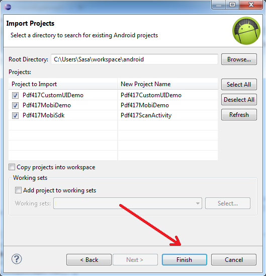

8. Three projects should appear:

	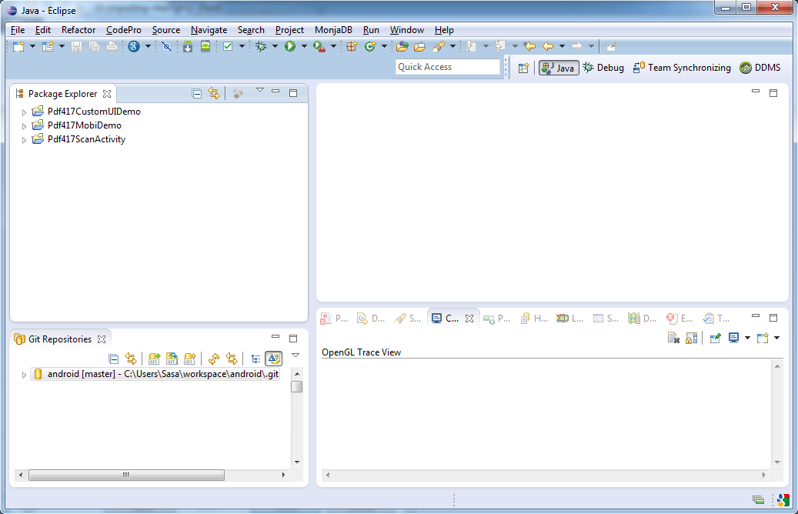

9. Plugin your Android phone to USB, right click on "Pdf417MobiDemo", then "Run As" and "Android Application" and voila, the app is built, installed and run on your phone:

	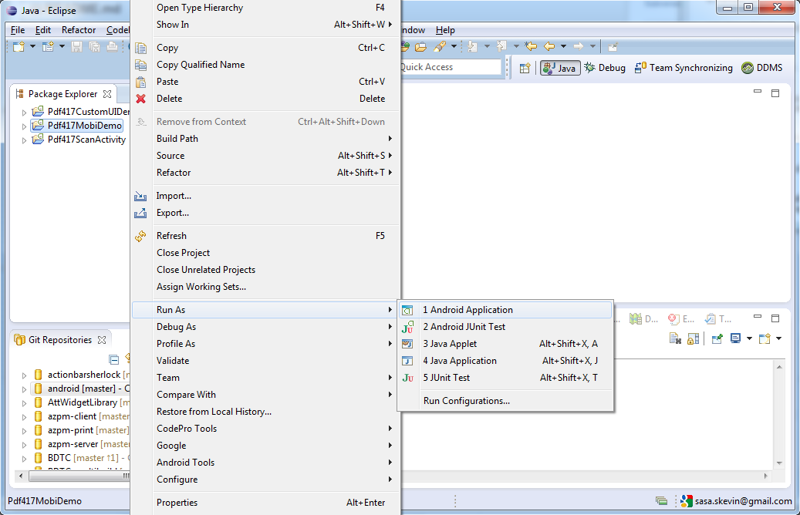

## How to integrate Pdf417MobiSdk into your project using Eclipse

1. Pdf417MobiSdk is an Android Library project with classes, resources and everything required to function properly. 
Simply place the project into your workspace and reference it from your application project. 

	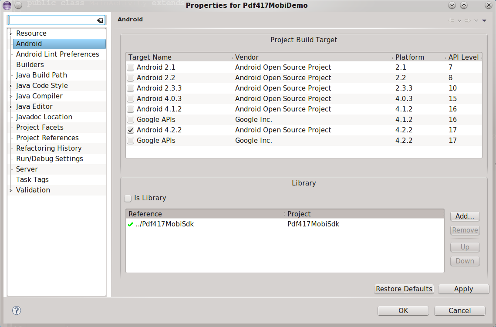
 	
2. Edit your `AndroidManifest.xml`. You should include camera and camera autofocus features:

```xml
<uses-permission android:name="android.permission.CAMERA" />

<uses-feature android:name="android.hardware.camera" />
<uses-feature android:name="android.hardware.camera.autofocus" />
```

Also, add Pdf417ScanActivity entry:

```xml
<activity android:name="mobi.pdf417.activity.Pdf417ScanActivity" android:label="@string/app_name" android:screenOrientation="portrait" />
```

## How to integrate Pdf417MobiSdk into your project using Android Studio and Gradle

1. Open your project using Android Studio, open Project structure dialog from File menu and select '+'. Proceed with 'Import existing project', select AndroidStudio/pdf417MobiSdk folder.  

	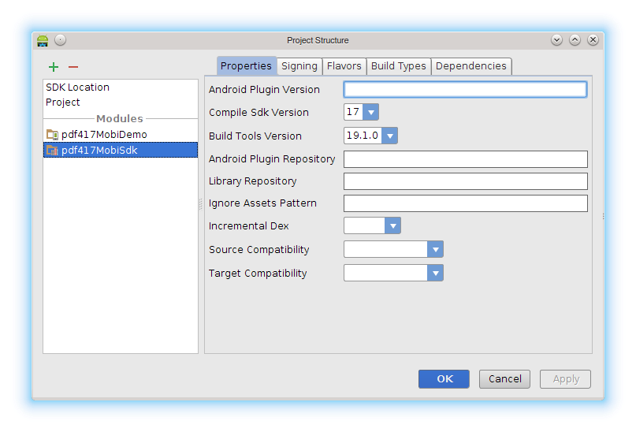

2. Edit your application build.gradle file, add dependency to pdf417MobiSdk library module:

    ```
    dependencies {
    	compile project(':pdf417MobiSdk')
    }
    ```

## How to integrate Pdf417MobiSdk into your project using Maven

Maven repository for PDF417.mobi SDK is: [http://pdf417.mobi/maven](http://pdf417.mobi/maven).

Open your pom.xml file and add these directives as appropriate:

```xml
<properties>
	<pdf417mobi.version>3.0.1</pdf417mobi.version>
</properties>

<repositories>
   	<repository>
       	<id>pdf417repo</id>
       	<url>http://pdf417.mobi/maven</url>
   	</repository>
</repositories>

<dependencies>
	<dependency>
		  <groupId>mobi.pdf417</groupId>
		  <artifactId>sdk-library</artifactId>
		  <version>${pdf417mobi.version}</version>
  	</dependency>

  	<dependency>
		  <groupId>mobi.pdf417</groupId>
		  <artifactId>sdk-resources</artifactId>
		  <type>aar</type>
		  <version>${pdf417mobi.version}</version>
  	</dependency>

  	<dependency>
		  <groupId>mobi.pdf417</groupId>
		  <artifactId>libPhotoPayBarcode</artifactId>
		  <type>so</type>
		  <classifier>armeabi</classifier>
		  <version>${pdf417mobi.version}</version>
  	</dependency>
	
	<dependency>
		  <groupId>mobi.pdf417</groupId>
		  <artifactId>libPhotoPayBarcode</artifactId>
		  <type>so</type>
		  <classifier>armeabi-v7a</classifier>
		  <version>${pdf417mobi.version}</version>
  	</dependency>

  	<dependency>
		  <groupId>mobi.pdf417</groupId>
		  <artifactId>libPhotoPayBarcode</artifactId>
		  <type>so</type>
		  <classifier>x86</classifier>
		  <version>${pdf417mobi.version}</version>
  	</dependency>
<dependencies>
```

Maven dependency has been tested on android-maven-plugin version 3.8.2.

## Proguard configuration

If you are using ProGuard, add the following lines to your application `proguard-project.txt` file

```
-keep class net.photopay.** { *; }

-keepclassmembers class net.photopay.** {
    *;
}

-keep class mobi.pdf417.** { *; }

-keepclassmembers class mobi.pdf417.** { 
    *; 
}

-dontwarn android.hardware.**

-dontwarn android.support.v4.**
```

## Starting a scan activity

You can start scanning process by starting `Pdf417ScanActivity` activity with Intent initialized in the following way:
    
```java
// Intent for Pdf417ScanActivity.class
Intent intent = new Intent(this, Pdf417ScanActivity.class);
		
// Start Activity
startActivityForResult(intent, MY_REQUEST_CODE);
```

`Pdf417ScanActivity` will return the result to your activity via intent passed to your `onActivityResult` method after user click `Use` button in dialog shown after successful scan. 

You can use pdf417 SDK free of change and without license key for development and non-commercial projects. Once you obtain a commercial license key from [www.pdf417.mobi](www.pdf417.mobi), you can set it with `EXTRAS_LICENSE_KEY` intent extra like this:
	
```java
// set the license key
intent.putExtra(Pdf417ScanActivity.EXTRAS_LICENSE_KEY, "Enter_License_Key_Here");
```
	
License key is bound to package name of your application. For example, if you have license key that is bound to `mobi.pdf417` app package, you cannot use the same key in other applications. However, if you purchase Premium license, you will get license key that can be used in multiple applications. This license key will then not be bound to package name of the app. Instead, it will be bound to the license owner string that needs to be provided to the library together with the license key. To provide license owner string, use the `EXTRAS_LICENSE_OWNER` intent extra like this:

```java
// set the license key
intent.putExtra(Pdf417ScanActivity.EXTRAS_LICENSE_KEY, "Enter_License_Key_Here");
intent.putExtra(Pdf417ScanActivity.EXTRAS_LICENSE_OWNER, "Enter_License_Owner_Here");
```

If you do not provide license owner, license key will be validated against current application package name and will fail to unlock the library.

You can also set additional settings to Intent used for initializing the `Pdf417ScanActivity`:

* If you want sound to be played after the scanning process ends, use `EXTRAS_BEEP_RESOURCE` to set the resource ID of the sound, like this
   
    ```java
	intent.putExtra(Pdf417ScanActivity.EXTRAS_BEEP_RESOURCE, R.raw.beep);
    ```

* If you want to always use the highest available camera resolution, set `EXTRAS_ALWAYS_USE_HIGH_RES` to true. This is by default enabled for all devices that support at least 720p camera preview frame size. To set this parameter, use the following code snippet:
	
    ```java
	intent.putExtra(Pdf417ScanActivity.EXTRAS_ALWAYS_USE_HIGH_RES, true);
    ```

* if you want to use front facing camera instead of back facing camera, you should set `EXTRA_CAMERA_TYPE` to `CAMERA_FRONTFACE`, like this:

    ```java
		intent.putExtra(Pdf417ScanActivity.EXTRAS_CAMERA_TYPE, (Parcelable)CameraType.CAMERA_FRONTFACE)
    ```
		
* if you want to set scanning region, you can do it in the following way:

    ```java
	// define scanning region
	// first parameter of rectangle is x-coordinate represented as percentage
	// of view width*, second parameter is y-coordinate represented as percentage
	// of view height*, third parameter is region width represented as percentage
	// of view width* and fourth parameter is region height represented as percentage
	// of view heigth*
	//
	// * view width and height are defined in current context, i.e. they depend on
	// screen orientation. If you allow your ROI view to be rotated, then in portrait
	// view width will be smaller than height, whilst in landscape orientation width
	// will be larger than height. This complies with view designer preview in eclipse ADT and android studio.
	// If you choose not to rotate your ROI view, then your ROI view will be layout either
	// in portrait or landscape, depending on setting for your camera activity in AndroidManifest.xml
	Rectangle roi = new Rectangle(0.2f, 0.1f, 0.5f, 0.4f);
	intent.putExtra(Pdf417ScanActivity.EXTRAS_ROI, roi);
	// if you intent to rotate your ROI view, you should set the EXTRAS_ROTATE_ROI extra to true
	// so that PDF417.mobi can adjust ROI coordinates for native library when device orientation
	// change event occurs
	intent.putExtra(Pdf417ScanActivity.EXTRAS_ROTATE_ROI, true);
    ```
		
* if you want to optimize camera parameters for near object scanning, you should set `EXTRAS_OPTIMIZE_CAMERA_FOR_NEAR_SCANNING` to `true`. When camera parameters are optimized for near object scanning, macro focus mode will be preferred over autofocus mode. Thus, camera will have easier time focusing on to near objects, but might have harder time focusing on far objects. If you expect that most of your scans will be performed by holding the device very near the object, turn on that parameter. By default, this parameter is set to `false`. Set the parameter like this:

    ```java
	intent.putExtra(Pdf417ScanActivity.EXTRAS_OPTIMIZE_CAMERA_FOR_NEAR_SCANNING, true)
    ```
		
* You can use `Pdf417MobiSettings` object to tweak additional scanning parameters. This is entirely optional. If you don't send this object via intent, default scanning parameters will be used - this means both QR and PDF417 codes will be scanned and default camera overlay will be shown. For example, you could set settings as in following example:

    ```java
	Pdf417MobiSettings sett = new Pdf417MobiSettings();
	// set this to true to enable PDF417 scanning
	sett.setPdf417Enabled(true);
	// Set this to true to scan even barcode not compliant with standards
	// For example, malformed PDF417 barcodes which were incorrectly encoded
	// Use only if necessary because it slows down the recognition process
	sett.setUncertainScanning(true);
	// Set this to true to scan barcodes which don't have quiet zone (white area) around it
	// Use only if necessary because it drastically slows down the recognition process 
	sett.setNullQuietZoneAllowed(true);
    // Set this to true to enable parsing of data from US Driver's License barcodes
    // This feature is available only if license key permits it.
    sett.setDecodeUSDriverLicenseData(true);
	// set this to true to enable QR code scanning
	sett.setQrCodeEnabled(true); 
	// set this to true to prevent showing dialog after successful scan
	sett.setDontShowDialog(false);
	// if license permits this, remove Pdf417.mobi logo overlay on scan activity
	// if license forbids this, this option has no effect
	sett.setRemoveOverlayEnabled(true);
	// put settings as intent extra
	intent.putExtra(BaseBarcodeActivity.EXTRAS_SETTINGS, sett);
    ```
	
## <a name="obtainScanResults"></a> Obtaining the scanning results

Obtaining the scanned data is done in the `onActivityResult` method. If the recognition returned some results, result code returned will be `BaseBarcodeActivity.RESULT_OK`. Optionally, if user tapped the `Copy` button in dialog, result code returned will be `BaseBarcodeActivity.RESULT_OK_DATA_COPIED` to indicate that barcode data is copied into clipboard. For example, your implementation of this method could look like this:

```java
@Override
protected void onActivityResult(int requestCode, int resultCode, Intent data) {
	super.onActivityResult(requestCode, resultCode, data);
	
    if(requestCode==MY_REQUEST_CODE && resultCode==BaseBarcodeActivity.RESULT_OK) {
    	// read scan result
		Pdf417MobiScanData scanData = data.getParcelableExtra(BaseBarcodeActivity.EXTRAS_RESULT);
    
        // read scanned barcode type (PDF417 or QR code)	
        String barcodeType = scanData.getBarcodeType();
        // read the data contained in barcode
        String barcodeData = scanData.getBarcodeData();
        // determine if returned data is uncertain
        boolean uncertainData = scanData.isResultUncertain();

        // in case US Driver's License data was parsed, you can access the fields
        // in the following way
        if(scanData instanceOf USDLScanData) {
            USDLScanData usdlData = (USDLScanData) scanData;
            // handle data
        }
        
        // ask user what to do with data
        Intent intent = new Intent(Intent.ACTION_SEND);
        intent.setType("text/plain");
        intent.putExtra(Intent.EXTRA_TEXT, barcodeType + ": " + barcodeData);
        startActivity(Intent.createChooser(intent, getString(R.string.UseWith)));
    }
}
```

You can also obtain the list of all data that have been scanned (if there is more than one). For that matter, you need to use `BaseBarcodeActivity.EXTRAS_RESULT_LIST` key as shown in following example:

```java
@Override
  protected void onActivityResult(int requestCode, int resultCode, Intent data) {
    super.onActivityResult(requestCode, resultCode, data);
	
    if(requestCode==MY_REQUEST_CODE && resultCode==BaseBarcodeActivity.RESULT_OK) {
        // read scan result
	    ArrayList<Pdf417MobiScanData> scanDataList = data.getParcelableArrayList(BaseBarcodeActivity.EXTRAS_RESULT_LIST);
    
        for(Pdf417MobiScanData scanData : scanDataList) {
            // do whatever you need to do with data
        }
    }
}
```

If US Driver's License decoding was used, you can also obtain parsed fields by casting `Pdf417MobiScanData` into `USDLScanData` class, and then use its methods to obtain driver's license fields:

```java
Pdf417MobiScanData scanData;
if(scanData instanceOf USDLScanData) {
    USDLScanData usdlData = (USDLScanData) scanData;
    String aamvaVersion = usdlData.getField(USDLScanData.kAamvaVersionNumber);
}
```

To see the list of available keys and their descriptions for obtaining the driver's licenses fields, see [Keys for obtaining US Driver's license data](DriversLicenseKeys.md).

In order to obtain raw barcode data, you need to obtain `BarcodeDetailedData` structure by calling `getBarcodeRawData` method of `Pdf417ScanData` instance returned via `BaseBarcodeActivity.EXTRAS_RESULT` extra in result intent. This structure will contain list of barcode elements. Each barcode element contains byte array with its raw data and type of that raw data. Type of raw data can be either `ElementType.TEXT_DATA` or `ElementType.BYTE_DATA`. `ElementType.TEXT_DATA` defines that byte array can be interpreted as string, whilst `ElementType.BYTE_DATA` defines that byte array is probably not string. However, you can always convert all data to string and you will then get the same string that you can obtain by calling `getBarcodeData`. For example, you can use that structure like this:

```java
@Override
protected void onActivityResult(int requestCode, int resultCode, Intent data) {
	super.onActivityResult(requestCode, resultCode, data);
	
    if(requestCode==MY_REQUEST_CODE && resultCode==BaseBarcodeActivity.RESULT_OK) {
   		// read scan result
		Pdf417MobiScanData scanData = data.getParcelableExtra(BaseBarcodeActivity.EXTRAS_RESULT);
		
        // read raw barcode data
        BarcodeDetailedData rawData = scanData.getBarcodeRawData();				
        // get list of barcode elements
    	List<BarcodeElement> elems = rawData.getElements();
        // log the amount of elements
        Log.i(TAG, "Number of barcode elements is " + elems.size());
	    // now iterate over elements
    	for(int i=0; i<elems.size(); ++i) {
    		BarcodeElement elem = elems.get(i);
    		// get the barcode element type
    		ElementType elemType = elem.getElementType();
    		// get raw bytes of the element
    		byte[] rawBytes = elem.getElementBytes();
    		
    		// do with that data whatever you want
    		// for example print it
    		Log.i(TAG, "Element #" + i + " is of type: " + elemType.name());
    		StringBuilder sb = new StringBuilder("{");
    		for(int j=0; j<rawBytes.length; ++j) {
    			sb.append((int)rawBytes[j] & 0x0FF);
    			if(j!=rawBytes.length-1) {
    				sb.append(", ");
    			}
    		}
    		sb.append("}");
    		Log.i(TAG, sb.toString());
    	}
	}
}
```

Additionally, if you don't need the whole per element information, you can just use `getAllData` method of `BarcodeDetailedData` class to obtain byte array of the whole barcode. Note that you need to be able to extract useful information from such a byte array on your own.

## Embedding `Pdf417MobiView` into custom scan activity
This section will discuss how to embed `Pdf417MobiView ` into your scan activity and perform scan.

1. First make sure that `Pdf417MobiView ` is a member field in your activity. This is required because you will need to pass all activity's lifecycle events to `Pdf417MobiView `.
2. It is recommended to keep your scan activity in one orientation, such as `portrait` or `landscape`. Setting `sensor` as scan activity's orientation will trigger full restart of activity whenever device orientation changes. This will provide very poor user experience because both camera and _PDF417.mobi_ native library will have to be restarted every time. There are measures for this behavious and will be discussed [later](#scanOrientation).
3. In your activity's `onCreate` method, create a new `Pdf417MobiView `, define its [settings and listeners](#photoPayViewReference) and then call its `create` method. After that, add your views that should be layouted on top of camera view.
4. Override your activity's `onResume`, `onPause`, `onStart` and `onStop` methods and call `Pdf417MobiView's` lifecycle methods `resume`, `pause`, `start` and `stop`. This will ensure correct camera and native resource management.

Here is the minimum example of integration of `Pdf417MobiView ` as the only view in your activity:

```java
public class MyScanActivity extends Activity implements Pdf417MobiScanResultListener {
	private Pdf417MobiView mPdf417MobiView;
		
	@Override
	protected void onCreate(Bundle savedInstanceState) {
		// create PhotoPayView
		mPdf417MobiView = new Pdf417MobiView(this);
		   
		/**
		* Prepare settings for recognition.
		*/
		Pdf417MobiSettings sett = new Pdf417MobiSettings();
		sett.setPdf417Enabled(true);
		sett.setDecodeUSDriverLicenseData(true);
		sett.setQrCodeEnabled(true);
		// set scanning settings
		mPdf417MobiView.setScanSettings(sett);
		// set license key
		mPdf417MobiView.setLicenseKey("your license key here");
		// set camera aspect mode
		// ASPECT_FIT will fit the camera preview inside the view
		// ASPECT_FILL will zoom and crop the camera preview, but will use the
		// entire view surface
		mPdf417MobiView.setAspectMode(CameraAspectMode.ASPECT_FILL);
		   
		// scan result listener will be notified when scan result gets available
		mPdf417MobiView.setPdf417MobiScanResultListener(this);
		   
		mPdf417MobiView.create();
		setContentView(mPdf417MobiView);
	}
	
	@Override
	protected void onResume() {
	   super.onResume();
	   // you need to pass all activity's lifecycle methods to Pdf417MobiView
	   mPdf417MobiView.resume();
	}
	    
	   @Override
	protected void onStart() {
	   super.onStart();
	   // you need to pass all activity's lifecycle methods to Pdf417MobiView
	   mPdf417MobiView.start();
	}

	@Override
	protected void onPause() {
	   super.onPause();
	   // you need to pass all activity's lifecycle methods to Pdf417MobiView
	   mPdf417MobiView.pause();
	}

	@Override
	protected void onStop() {
	   super.onStop();
	   // you need to pass all activity's lifecycle methods to Pdf417MobiView
	   mPdf417MobiView.stop();
	}

	@Override
	public void onConfigurationChanged(Configuration newConfig) {
	   super.onConfigurationChanged(newConfig);
	   // you need to pass all activity's lifecycle methods to Pdf417MobiView
	   mPdf417MobiView.changeConfiguration(newConfig);
	}
	
    @Override
    public void onScanningDone(ArrayList<Pdf417MobiScanData> scanDataList) {
    	// this method is from Pdf417MobiScanResultListener and will be called when scanning completes
    	// multiple scan results may be returned, depending on scanning settings used for initialization of view
    }
}
```

### <a name="scanOrientation"></a> Scan activity's orientation

If activity's `screenOrientation` property in `AndroidManifest.xml` is set to `sensor`, `fullSensor` or similar, activity will be restarted every time device changes orientation from portrait to landscape and vice versa. While restarting activity, its `onPause`, `onStop` and `onDestroy` methods will be called and then new activity will be created anew. This is a potential problem for scan activity because in its lifecycle it controls both camera and native library - restarting the activity will trigger both restart of the camera and native library. This is a problem because changing orientation from landscape to portrait and vice versa will be very slow, thus degrading a user experience. **We do not recommend such setting.**

For that matter, we recommend setting your scan activity to either `portrait` or `landscape` mode and handle device orientation changes manually. To help you with this, `Pdf417MobiView ` supports adding child views to it that will be rotated regardless of activity's `screenOrientation`. You add a view you wish to be rotated (such as view that contains buttons, status messages, etc.) to `Pdf417MobiView ` with `addChildView` method. The second parameter of the method is a boolean that defines whether the view you are adding will be rotated with device. To define allowed orientations, implement [OrientationAllowedListener](Javadoc/net/photopay/view/OrientationAllowedListener.html) interface and add it to `Pdf417MobiView ` with method `setOrientationAllowedListener`. **This is the recommended way of rotating camera overlay.**

However, if you really want to set `screenOrientation` property to `sensor` or similar and want Android to handle orientation changes of your scan activity, then we recommend to set `configChanges` property of your activity to `orientation|screenSize`. This will tell Android not to restart your activity when device orientation changes. Instead, activity's `onConfigurationChanged` method will be called so that activity can be notified of the configuration change. In your implementation of this method, you should call `changeConfiguration` method of `Pdf417MobiView ` so it can adapt its camera surface and child views to new configuration. Note that on Android versions older than 4.0 changing of configuration will require restart of camera, which can be slow.

__Important__

If you use `sensor` or similar screen orientation for your scan activity there is a catch. No matter if your activity is set to be restarted on configuration change or only notified via `onConfigurationChanged` method, if your activity's orientation is changed from `portrait` to `reversePortrait` or from `landscape` to `reverseLandscape` or vice versa, your activity will not be notified of this change in any way - it will not be neither restarted nor `onConfigurationChanged` will be called - the views in your activity will just be rotated by 180 degrees. This is a problem because it will make your camera preview upside down. In order to fix this, you first need to [find a way how to get notified of this change](https://stackoverflow.com/questions/9909037/how-to-detect-screen-rotation-through-180-degrees-from-landscape-to-landscape-or) and then you should call `changeConfiguration` method of `Pdf417MobiView` so it will correct camera preview orientation.

## <a name="photoPayViewReference"></a> `Pdf417MobiView` reference
The complete reference of `Pdf417MobiView` is available in [Javadoc](Javadoc/net/photopay/view/recognition/Pdf417MobiView.html). The usage example is provided in `Pdf417CustomUIDemo` demo app provided with SDK. This section just gives a quick overview of `PhotoPayView's` most important methods.

### `create()`
This method should be called in activity's `onCreate` method. It will initialize `Pdf417MobiView's` internal fields. This method must be called after all other settings are already defines, such as listeners and scanning settings. After calling this method, you can add child views to `Pdf417MobiView` with method `addChildView(View, boolean)`.

### `start()`
This method should be called in activity's `onStart` method. It will initialize background processing thread and start native library initialization on that thread.

### `resume()`
This method should be called in activity's `onResume` method. It will trigger background initialization of camera.

### `pause()`
This method should be called in activity's `onPause` method. It will stop the camera, but will keep native library loaded.

### `stop()`
This method should be called in activity's `onStop` method. It will deinitialize native library and free all resources that are no longer necessary.

### `changeConfiguration(Configuration)`
This method should be called in activity's `onConfigurationChanged` method. It will adapt camera surface to new configuration without the restart of the activity. See [Scan activity's orientation](#scanOrientation) for more information.

### `setLicenseKey(String licenseKey)`
This method sets the license key that will unlock all features of the native library. You can obtain your license key from [pdf417.mobi website](http://pdf417.mobi/).

### `setLicenseKey(String licenseKey, String licenseOwner)`
Use this method to set a license key that is bound to a license owner, not the application package name. You will use this method when you obtain a license key that allows you to use PDF417.mobi SDK in multiple applications. You can obtain your license key from [pdf417.mobi website](http://pdf417.mobi/).

### `setCameraType(CameraType)`
With this method you can define which camera on device will be used. Default camera used is back facing camera.

### `setAspectMode(CameraAspectMode)`
Define the aspect mode of camera. If set to `ASPECT_FIT` (default), then camera preview will be fit inside available view space. If set to `ASPECT_FILL`, camera preview will be zoomed and cropped to use the entire view space.

### `setScanSettings(Pdf417MobiSettings)`
With this method you can set the `Pdf417MobiSettings` object. This object contains information about what and how will scan be performed. For more information about methods of that object, consult [Javadoc](Javadoc/mobi/pdf417/Pdf417MobiSettings.html).

### `setOrientationAllowedListener(OrientationAllowedListener)`
With this method you can set a [OrientationAllowedListener](Javadoc/net/photopay/view/OrientationAllowedListener.html) which will be asked if current orientation is allowed. If orientation is allowed, it will be used to rotate rotatable views to it and it will be passed to native library so that recognizers can be aware of the new orientation.

### `setRecognizerViewEventListener(RecognizerViewEventListener)`
With this method you can set a [RecognizerViewEventListener](Javadoc/net/photopay/view/recognition/RecognizerViewEventListener.html) which will be notified when certain recognition events occur, such as when object has been detected.

### `setPdf417MobiScanResultListener(Pdf417MobiScanResultListener)`
With this method you can set a [Pdf417MobiScanResultListener](Javadoc/net/photopay/view/recognition/Pdf417MobiScanResultListener.html) which will be notified when recognition completes. After recognition completes, `Pdf417MobiView` will pause its scanning loop and to continue the scanning you will have to call `resumeScanning` method. In this method you can obtain data from scanning results. For more information see [Obtaining the scanning results](#obtainScanResults).

### `setCameraEventsListener(CameraEventsListener)`
With this method you can set a [CameraEventsListener](Javadoc/net/photopay/view/CameraEventsListener.html) which will be notified when various camera events occur, such as when camera preview has started, autofocus has failed or there has been an error while starting the camera.

### `pauseScanning()`
This method pauses the scanning loop, but keeps both camera and native library initialized. This method is called internally when scan completes.

### `resumeScanning()`
With this method you can resume the paused scanning loop.

### `addChildView(View, boolean)`
With this method you can add your own view on top of `PhotoPayView`. `PhotoPayView` will ensure that your view will be layouted exactly above camera preview surface (which can be letterboxed if aspect ratio of camera preview size does not match the aspect ratio of `PhotoPayView`). Boolean parameter defines whether your view should be rotated with device orientation changes. The rotation is independent of host activity's orientation changes and allowed orientations will be determined from [OrientationAllowedListener](Javadoc/net/photopay/view/OrientationAllowedListener.html). See also [Scan activity's orientation](#scanOrientation) for more information why you should rotate your views independently of activity.

### `isCameraFocused()` 
This method returns `true` if camera thinks it has focused on object. Note that camera has to be loaded for this method to work.

### `focusCamera()` 
This method requests camera to perform autofocus. If camera does not support autofocus feature, method does nothing. Note that camera has to be loaded for this method to work.

### `isCameraTorchSupported()` 
This method returns `true` if camera supports torch flash mode. Note that camera has to be loaded for this method to work.

### `setTorchState(boolean)` 
If torch flash mode is supported on camera, this method can be used to enable/disable torch flash mode. If operation is successful, method returns true. Note that camera has to be loaded for this method to work.


## Processor architecture considerations

Since version 3.0.0, Pdf417.mobi is distributed with both ARMv6, ARMv7 and x86 native library binaries. Older versions were built only for ARM architectures.

ARMv7 architecture gives the ability to take advantage of hardware accelerated floating point operations and SIMD processing with [NEON](http://www.arm.com/products/processors/technologies/neon.php). This gives Pdf417.mobi a huge performance boost on devices that have ARMv7 processors. Most new devices (all since 2012.) have ARMv7 processor so it makes little sense not to take advantage of performance boosts that those processors can give.

x86 architecture gives the ability to obtain native speed on x86 android devices, like [Prestigio 5430](http://www.gsmarena.com/prestigio_multiphone_5430_duo-5721.php). Without that, Pdf417.mobi will not work on such devices, or it will be run on top of ARM emulator that is shipped with device - this will give a huge performance penalty.

However, there are some issues to be considered:

- ARMv7 processors understand ARMv6 instruction set, but ARMv6 processors do not understand ARMv7 instructions.
- if ARMv7 processor executes ARMv6 code, it does not take advantage of hardware floating point acceleration and does not use SIMD operations
- ARMv7 build of native library cannot be run on devices that do not have ARMv7 compatible processor (list of those old devices can be found [here](http://www.getawesomeinstantly.com/list-of-armv5-armv6-and-armv5-devices/))
- neither ARMv6 nor ARMv7 processors understand x86 instruction sets
- x86 processors do not understand neither ARMv6 nor ARMv7 instruction set
- however, some x86 android devices ship with the builtin [ARM emulator](http://commonsware.com/blog/2013/11/21/libhoudini-what-it-means-for-developers.html) - such devices are able to run ARM binaries (both ARMv6 and ARMv7) but with performance penalty. There is also a risk that builtin ARM emulator will not understand some specific ARM instruction and will crash.

Pdf417MobiSdk android library contains both ARMv6, ARMv7 and x86 builds of native library. Those build are found in subfolder `libs`:

- `libs/armeabi` contains native libraries for ARMv6 processor architecture
- `libs/armeabi-v7a` contains native libraries for ARMv7 processor arhitecture
- `libs/x86` contains native libraries for x86 processor architecture

By default, when you integrate Pdf417MobiSdk into your app (see above for instructions), your app will contain native builds for all processor architectures. Thus, Pdf417.mobi will work on ARMv6 and x86 devices and will use ARMv7 features on ARMv7 devices. However, the size of your application will be rather large.

### Reducing the final size of your app

If your final app is too large because of PDF417.mobi, you can decide to remove one processor architecture from Pdf417MobiSdk. You can do this just by deleting appropriate folder inside Pdf417MobiSdk that contains native library for specific processor architecture:

- to remove ARMv6 support, delete folder `libs/armeabi`
- to remove ARMv7 support, delete folder `libs/armeabi-v7a`
- to remove x86 support, delete folder `libs/x86`

However, removing a processor architecture has some consequences:

- by removing ARMv6 support PDF417.mobi will not work on devices that have ARMv6 processors.
- by removing ARMv7 support, PDF417.mobi will work on both devices that have ARMv6 and ARMv7 processor. However, on ARMv7 processors, hardware floating point and SIMD acceleration will not be used, thus making PDF417.mobi much slower. 
- by removing x86 support, PDF417.mobi will not work on devices that have x86 processor, except in situations when devices have ARM emulator - in that case, PDF417.mobi will work, but will be slow

Our recommendation is to include both ARMv6, ARMv7 and x86 versions into your app - it will work on all devices and will provide best user experience. However, if you really need to reduce the size of your app, we recommend releasing three versions of your app - one version with only ARMv6 version of PDF417.mobi for old devices, one version with only ARMv7 version of PDF417.mobi for new devices and one version with only x86 version of PDF417.mobi for those rare x86 devices.

**Important note**

If you are combining PDF417.mobi library with some other libraries that contain native code into your application, make sure you match the architectures of all native libraries. For example, if third party library has got only ARMv6 and x86 versions, you must use exactly ARMv6 and x86 versions of PDF417.mobi with that library, but not ARMv7. Using ARMv7 will most definitely crash your app on loading time on some devices because it will try to load all its native dependencies in same preferred architecture - for example Nexus 4 preferres ARMv7 native libraries so it will see that there is a PDF417.mobi ARMv7 native library and will load it. After that, it will try to load ARMv7 version of your third party library which does not exist - therefore app will crash with `UnsatisfiedLinkException`.


## Translation and localisation

- Adding new language

	Pdf417.mobi can easily be translated to other languages. The `res` folder in Pdf417MobiSdk library project has folder `values` which contains `strings.xml` - this file contains english strings. In order to make e.g. Croatian translation, create a folder `values-hr` in your project and put the copy of `strings.xml` inside it. Then, open that file and change the english version strings into Croatian version. 

- Modifying other resources.

	You can also modify other resources, such as colours and camera overlay layouts. To change a colour, simply open res/values/colors.xml and change the values of colours. Creating custom camera overlay in your own scan activity is explained in demo application called `Pdf417CustomUIDemo`. In order to be able to directly use `Pdf417MobiView`, you must buy a commercial license.
	
	License key is bound to package name of application which integrates the library. Demo license key works for package name `mobi.pdf417`. To integrate library properly into your application, obtain a license from [PDF417.mobi web]. 
		
## Troubleshooting

In case of problems with using the SDK, you should do as follows:

* Enable logging to get the ability to see what is library doing. To enable logging, put this line in your application:

		net.photopay.util.Log.setLogLevel(net.photopay.util.Log.LogLevel.LOG_VERBOSE);

After this line, library will display as much information about its work as possible. Make sure to remove this line in your production code as lots of log outputs may slow down the performance of library.

If you cannot solve problems by yourself, do not hesitate to contact us at <pdf417@photopay.net>. Make sure you include the logs when contacting us to minimise the time to find and correct a bug. Also, if having problems reading specific barcodes, please send us high resolution scans of those problematic barcodes.

## Pdf417MobiDemo application

In the package is the working demo application in which you can experiment with integration details. Also, in the package there is `Pdf417CustomUIDemo`

## Additional info

If you have problems running the demo, try multiple refreshes, clean builds, close/open projects and Android Tools -> Fix Project Properties. In many situations this helps.

Also, feel free to contact us at <pdf417@photopay.net>.


[javadoc]: Javadoc/index.html
[PDF417.mobi web]: http://pdf417.mobi
